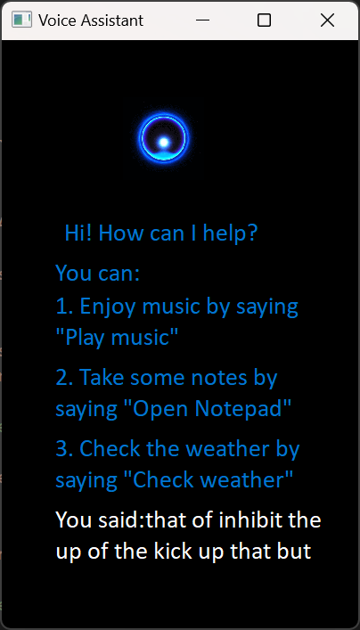
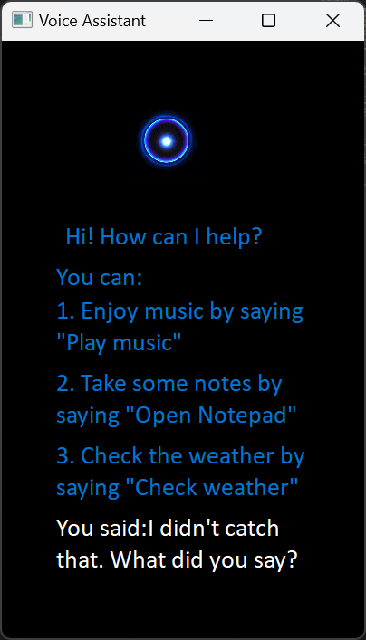
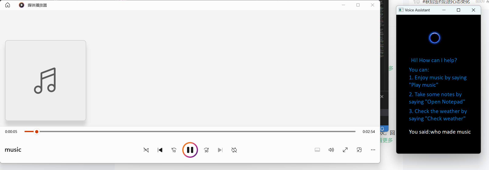
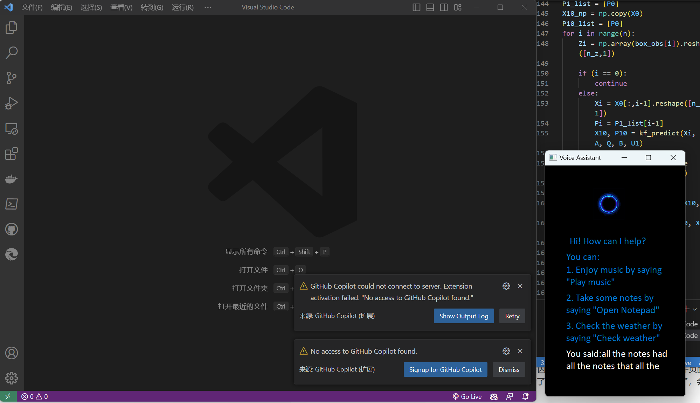
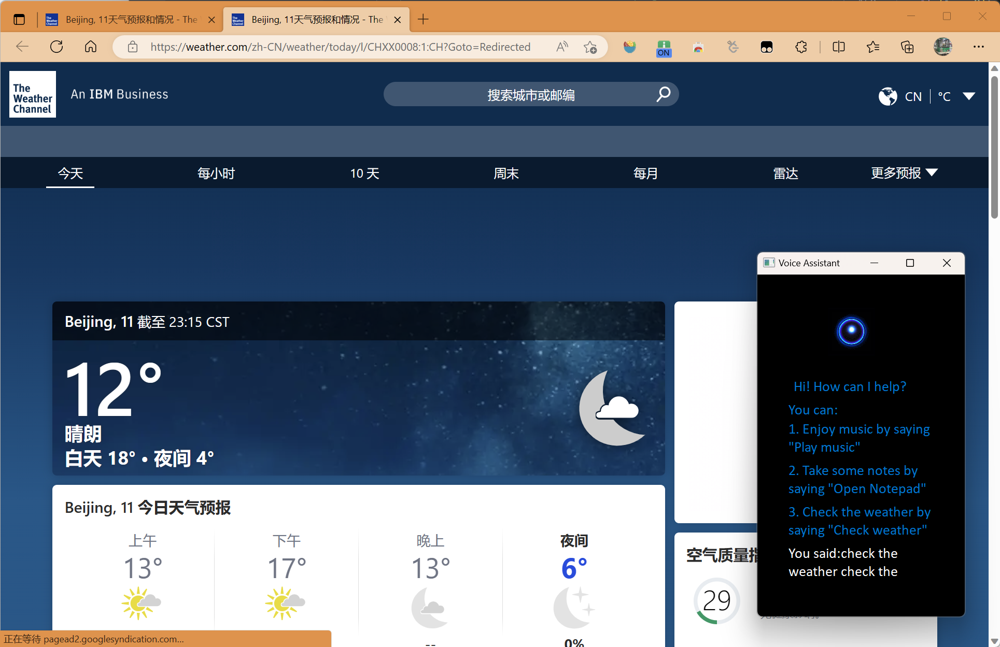

# Lab1-1

> Human-computer Interaction 2023 Spring 

**1953921 陈元哲**

## 1 GUI Design




The GUI style I designed is similar to the example program, I modified some details below:

1. Changed the mainwindow size
   To display more information, I chose a bigger mainwindow size.

   ```python
   MainWindow.resize(400, 660)
   ```

2. Added task description
   Besides the basic task which the example program given, I implement a weather reporter task. I added a corresponding prompt on the user interaction page.

   ```python
    		# Add command help
           self.label_5=QtWidgets.QLabel(self.centralwidget)
           self.label_5.setFont(font)
           self.label_5.setStyleSheet("color: rgb(0,117,210);")
           self.label_5.setGeometry(QtCore.QRect(60,440,300,70))
           self.label_5.setWordWrap(True)
           self.label_5.setObjectName("label_5")
   ```

3. Added echoing of user speech input
   To implement a better user interact experience, I added echoing of the user's speech input. It's convenient for my development and debug too.

   ```python
           # Add recognization info
           self.reText=QtWidgets.QLabel(self.centralwidget)
           self.reText.setFont(font)
           self.reText.setStyleSheet("color: rgb(255,255,255);")
           self.reText.setWordWrap(True)
           self.reText.setObjectName('reText')
           self.reText.setGeometry(QtCore.QRect(60,520,300,70))
   ```

   We can show the user's speech's recognition result by calling this funtion:
   ```python
   def add_reText_info(self,content):
        self.reText.setText(f'You said:{content}')
   ```

   This area can also display the exception information
   

## 2 Implementation method

### Speech recognition

I used `speech_recognition` package in python, the function same to the example program `guessTheWord.py`, it returns the recognition result and it is robust for exception handling.

### Method to enhance recognition accuracy

After testing, I found that the recognition rate is low using this package, here is the solution:

1. Increase keyword ambiguity
   We can matching the key words and vowels and instead of matching the complete command. This method can improve recognition accuracy significantly.

   ```python
       if sentence.__contains__('pad') or sentence.__contains__('note') or sentence.__contains__('pa'):
           # print('notepad')
           win32api.ShellExecute(0, 'open', 'code', '', '', 1)
           time.sleep(1)
       elif sentence.__contains__('play') or sentence.__contains__('playing') or sentence.__contains__('music'):
           # print('music')
           win32api.ShellExecute(0, 'open', '.\\music.mp3', '', '', 1)
           time.sleep(1)
       elif sentence.__contains__('check') or sentence.__contains__('weather') or sentence.__contains__('wea'):
           win32api.ShellExecute(0,'open','msedge','https://www.weather.com','',1)
           time.sleep(1)
   ```

The others methods I didn't test in my program, but they make sence

2. Change recognition APIs
   There are many python speech recognition APIs thesedays, we can choose another APIs to have a better recognition accuracy. However, the CMU Sphinx APIs which I chosen is offline APIs with the CMU Sphinx engine, the others APIs, for instance, Google Cloud Speech, require the connection with the recognition servers. Due to the internet issue, I did not manage to implement it.
3. Use advanced ML model
   We can use the advanced ML method to train language model. For instance, we can use BERT(Bidirectional Encoder Representations from Transformers) model. Moreover, we can use multimodel speech recognition method, adding viusal information to train the model. I found a representative result [2201.02184Learning Audio-Visual Speech Representation by Masked Multimodal Cluster Prediction (arxiv.org)](https://arxiv.org/abs/2201.02184)

### Task implement

I used win32api to execute shell command to implement the task. I used the function `ShellExecute()`, it receive 6 params:

1. `hwnd`
   Integer, used to specify the handle of the parent window. It is usually set to 0, indicating that there is no parent window.
2. `operation`
   String, representing the operation to be performed. 
3. `file`
   String, specifying the file, application, or URL to be operated on. If an application is specified, command line arguments can be included.
4. `parameters`
   String, specifying the command line arguments to be passed to the application. If no arguments need to be passed, an empty string or None can be used.
5. `directory`
   String, specifying the working directory of the application. If not specified, the default is the current directory.
6. `show`
   Integer, specifying how the application window should be displayed. 

To implement "check the weather" task, I use this function to open the browser and open specific URL.

### Multi Thread

In this program, GUI and speech recognition function should work together. These two part need to communicate with each other, for instance, GUI should display the recognition result on the GUI to inform user.

So, we packaged the recognition function in the `myWindow` class which named `mainfunc()`. We used python standard library `threading` to set a thread of execution.

```python
    def run(self):
        self.show()
        thread=Thread(target=self.mainfunc)
        thread.setDaemon(True)
        thread.start()
```

### 3 Program test

1. play music
   

2. open notepad
   
3. Check the weather
   