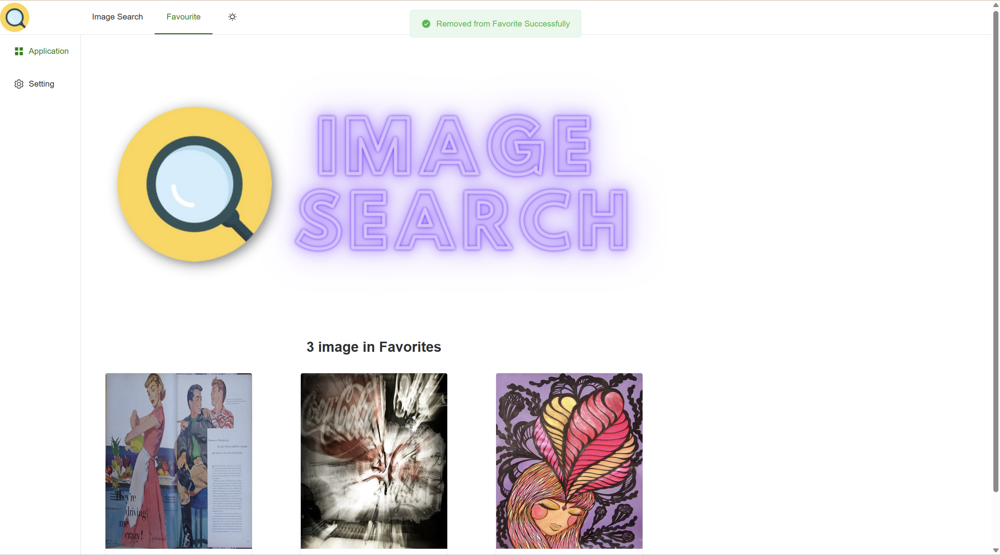

# Lab2

> Human-computer Interaction 2023 Spring 

**1953921 陈元哲**

## 1 Requirements

As a user interface of an image search system, our primary requirement should be user-friendly and efficient for users to interact with information. We can analyze the requirements based on the Five-stage framework taught by Pro. Shen in class.

1. Formulation
2. Initiation of action
3. Review of results
4. Refinement
5. Use

Five-stages can be repeated until users' needs are met. If users' are unsatisfied with the results, they should be able to have additional options and change their queries easily.

By incorporating the Five-stage framework with our image search system, we can refine and clearify our requirements.

1. Formulation
   - It contains an input box to upload an image
   - Users can preview the query image in the searching window
   - **Users can change the input image**
   - **Users can change to dark mode**
2. Initiation of action
   - It has a search button 
3. Review of results
   - Provide the total number of results
   - **Users can click on search result previews to view raw images**
4. Refinement
   - Allow changing search parameters, we choose images' tag as parameter. Users can choose different tag to filter the search result
5. Use
   - Users can add selected images to favorite list
   - **Users can review favorite list**

## 2 Implements

To better achieve the above requirements, I used Vue3 front-end framework for the design and implementation of the user interface. I chose element-plus as the components lib. I will showcase the user inferface by combining its functionality with the Five-stage framework. 

### Before Search

- Formulation

  - I use the horizontal and vertical navigation bars to organize the relationships between the functions.

  - I implemented a upload box, it supports drag uploading and click to upload
  - After uploading the image, user can preview the image via the box, and click the delete button to change the input image.
  - User can click the button at navigation bar to switch to dark mode at any time.

- Initiation of action
  - By clicking the search button below the upload box, user can enter the searching phrase.

### Searching

- Formulation
  - After clicking on the search button, a user prompt will appear indicating that the system is searching for results haven't been obtained.

### After Search

- Review of results
  - I used card component to display the result.
  - It provides the total number of results.
  - By clicking the previews, users can view raw images.

- Refinement

  - We use select component to allow users to select image tag quickly.
    

  - After selecting a tag, users can click Filter button to start refinement.
    

  - You can have the filtered result after clicking the button.

    

  - Users can clear the filters to restore the state before filtering.
    
    
    

- Use
  - By clicking the Add Favorite button in the card component, users can add the image into favorites.
    
  - If the image already in the favorites, there will be a user prompt.
    

### View Favorites

By clicking the Favorite button on the navigation bar above, it can route to the favorites page.

- Review of results
  - Provide the total number of favorites.
  - Users can click the image to view raw image.

- Use
  - Users can click the Remove Favorite button to remove the image from favorites.
  - After the removement, there will be a user prompt and update favorites results automatically.

