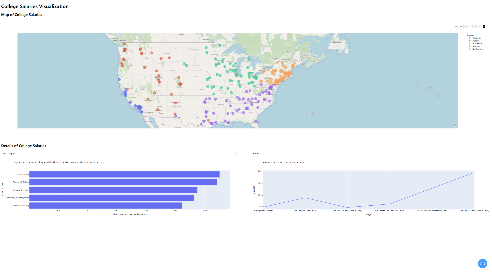
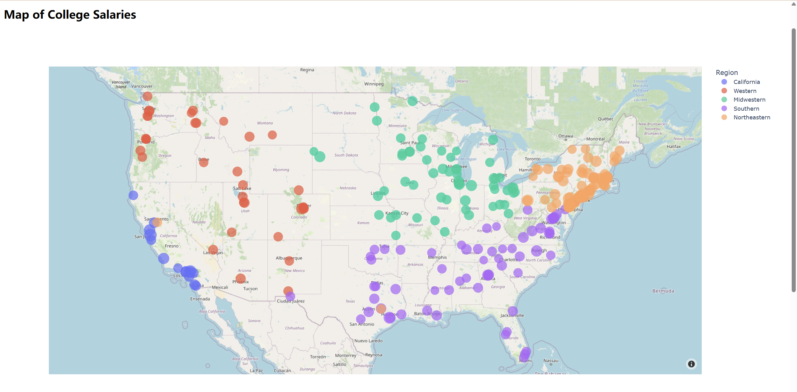
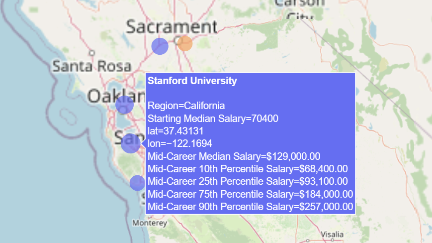
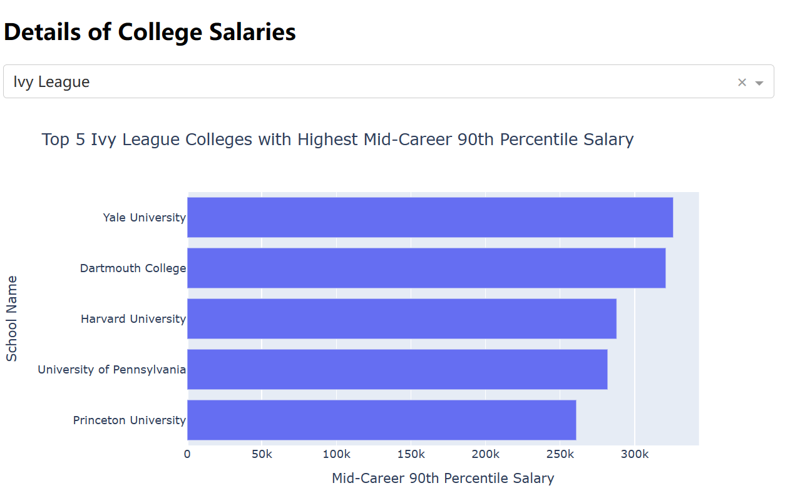
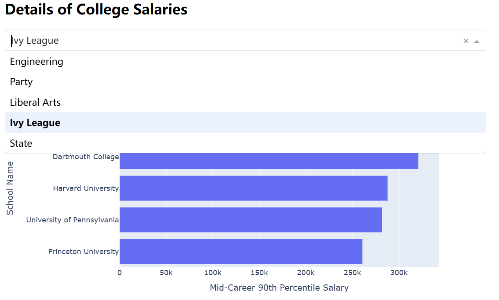
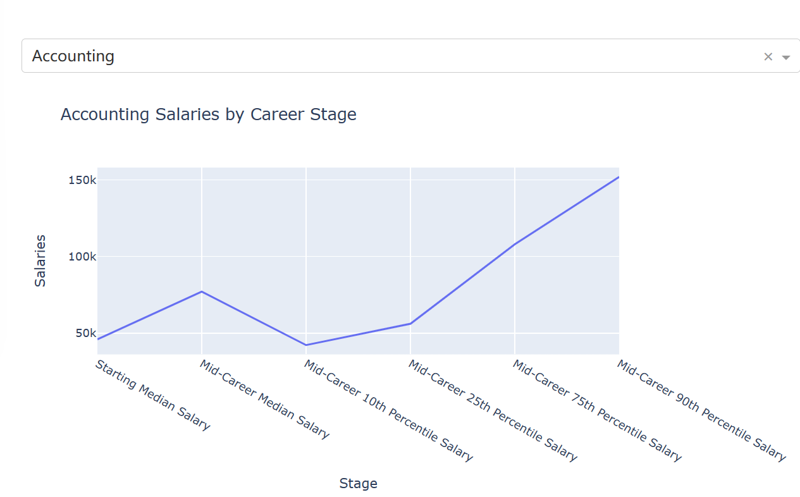

# Lab3

> Human-computer Interaction 2023 Spring

**1953921 陈元哲**

## 1 Data Analysis Task

Among the three topics proposed by Pro.Shen, I have chosen the topic of **college salaries** for data visualization.

The dataset provides three CSV-formatted tables, each depicting the relationship between the salaries of college graduates and variables such as geographical regin, academic major, and type of institution.

It is essential that the dataset describes salaries in a multi-dimensional manner, including `Starting Median Salary`,`Mid-Career Median Salary`,``Mid-Career 10th Percentile Salary`,`Mid-Career 25th Percentile Salary`,`Mid-Career 75th Percentile Salary`,`Mid-Career 90th Percentile Salary`. The dataset reflects salaries at different career stages and levels, enabling a more comprehensive understanding of the data.

The primary objective of our visualization is to illustrate the connection between college salaries and various factors. It is essential to capture the unique characteristics of the data for visualization. For example, as the salary is a numerical value, we are concerned about its specific magnitude. Regarding location data, we are interested in its geographical distribution. For the undergraduate major and school type, we need to provide users with different options for comparative analysis.

## 2 Dashboard Design



The dashboard primarily consists of three components: map of college salaries, the bar chart of top5 ranking salaries in the same type of schools, and the line graph of salaries by major.

### Map of College Salaries



I have implemented a map of college salaries, where colored dots distributed across the map represent the locations of universities in corresponding region. The size of each dot is proportional to the `Starting Median Salary` of each university.

To implement this map, I processed the raw data from file `salaries-by-region.csv` first. To get obtain the precise coordinates of each university, I utilized the geopy library to query locations based on the name of the unibersities. The complete code is in file `data_prep.py`.

```python
import geopy.geocoders
...
# Search for location
for index, row in df.iterrows():
    location = geolocator.geocode(row['School Name'])
    if location is not None:
        df.at[index, 'lat'] = location.latitude
        df.at[index, 'lon'] = location.longitude
...
```

When the cursor hovers over the colored dots on the map, detailed information of the university located at that spot is displayed.



**Patterns revealed in the figure**

Universities close to the coastline and developed areas tend to have higher salaries, particularly those located near California and New York State.

### Bar Chart of Top5 Ranking Salaries Schools



We use `Mid-Career 90th Percentile Salary` to represent the highest salaries level of each university. I have implemented a bar chart to visualize the top5 highest salary in the same type of schools. Users can change the school type by selecting in the dropdown box.



**Patterns revealed in the figure**

Ivy League universities hold a significant advantage in salary levels, followed closely by institutes of technology. Addtionally, graduates from Yale Uniersity exhibit the highest salary potential.

### Line Chart of Salaries in Different Stage



To illustrate the relationship between university salaries and majors, we employed a line graph to represent the salary changes of different majors at different stages. I utilized a dropdown selection box to alternate the input major.

**Patterns revealed in the figure**

Each major has a different career trajectory, and salary trends can vary accordingly. From the perspective of starting salaries, technical majors such as computer engineering and mechanical engineering are very competitive. However, when it comes to career income ceiling, business majors such as economics and finance show higher earning potential.