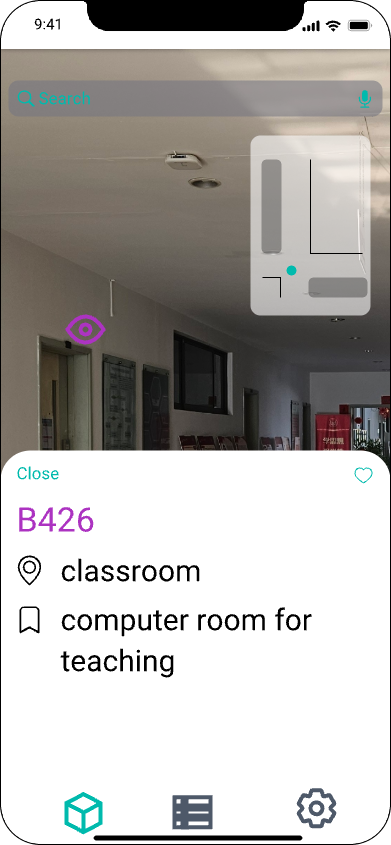

# Lab4

> Human-computer Interaction 2023 Spring

**1953921 陈元哲**

## 1 Requirements

We are required to design a mobile App, in which users can be guided to each room in SSE at Jishi building 4th floor. The App should satisfy the requirements below:

1. Users can browser the overview of every room in SSE
2. Users can select a specific room and look into it
3. Users can search keywords and get the results

I used a Figma like prototype design web tool, based on ios style, designed three pages of the App. I will introduce the page I designed and explain the reasons for the interaction I chose.

## 2 Design prototype

### Navigation Page

 

The navigation page, which is also the main page. I referred to the interaction method of the Street View Map in Google Maps, and conducted room tours by simulating users' movement indoors. The components on the page from top to bottom are as follows:

1. Search Bar
   Users can enter the keywords and get the ruslt in **Search Page**. When the user provides more detailed information, reusults can be quickly got using this method. 
2. Mini Map
   Provide an overall view for the guidance, users can obtain their relative postition indoors from the current viewpoint through this.

3. Room Tag
   A purple interactive button, by pressing it, users can jump to the corresponding **Detail Page**. Such a design is simple, aesthetically pleasing, and intuitive.
4. Direction Navigation
   The four combined direction buttons in the lower left corner of the main view provide positional movement, with the direction of movement referencing the current viewpoint. This design simulates the user's movement indoors, making it intuitive and clear.
5. Viewpoint Stick
   The stick in the lower right corner of the main view provide viewpoint shift. This is a typical scene interaction method.
6. Bottom Navigation Bar
   This is the main navigation bar of the App. It contains three buttons, linking to three main pages. From left to right, they link to the current **Navigation Page**, the **List Page**, and the setting page. The clear navigation bar at the bottom conforms to fluid navigation design principle, providing users with a clear function orientation.

### Detail Page

In order to hightlight the main function of indoor navigation, our other pages all display information in the form of cards base on the **Navigation Page**.

In this page, we display the basic information of the room, including name, type, description and other information, for instance, staff in the room type 'office', of the room.

The navigation interaction is very clear. This is a 'Close' button to back to the last page in the top-left of the card. By pressing the 'favorite' button, users can add the room to his favorite collection.

### List Page

In this page, users can get a overall view of the room in SSE. It display the key information of each room. By touching the room component, the page will jump to the corresponding **Detail Page**.

In this page, the search bar in the top is used to search keyword in the list. Such component reuse is aesthetically pleasing and straightforward, making it convenient for users and in line with design principles. 

### Search Page

This page shows how the result after the user performs a search from the navigation page. The user's viewpoint will switch to the front of the search result's location (if the search is successful), displaying detailed information about the target result. Unlike the details page, information related to the search will be highlighted.

